# Python软件安装
## 文件名称:
python-3.5.1-amd64  
pycharm-community-2020.1.1  
先安装python-3.5.1-amd64,然后再安装pycharm-community-2020.1.1    
1、安装python-3.5.1-amd64    
安装前首先确认系统电脑是64位的，否则无法安装  
## 查看系统位数  
### 点击微软开始菜单
### 点击设置按钮
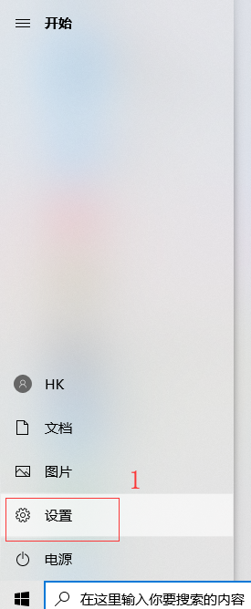
### 点击系统
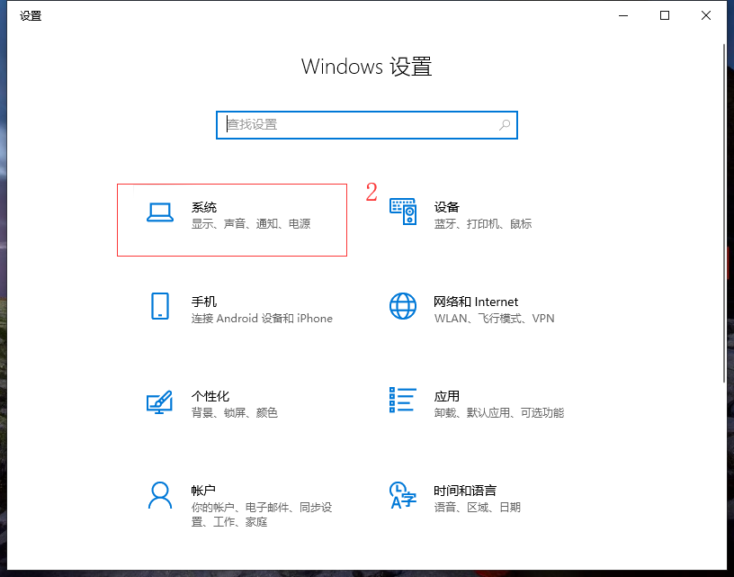
### 左侧栏目拖到最底下，选择关于就可以看到自己系统的位数
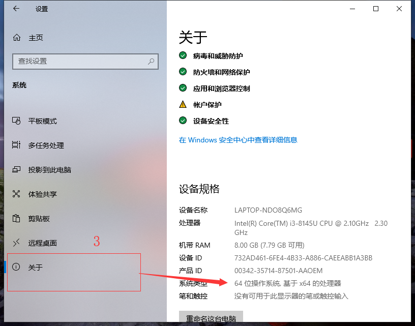
满足以上条件者才可以继续进行下面的操作  
### 双击python-3.5.1-amd64    
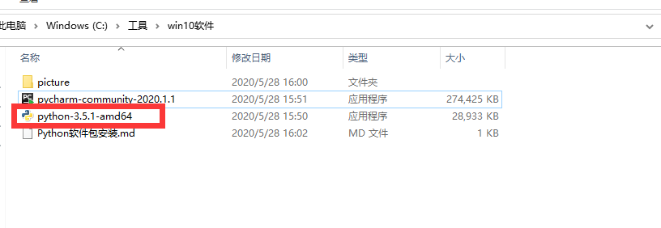
### 选择红框的Customize installation(个性化安装)
### 勾选下方的 Add Python 3.5 To PATH,一定要勾选，一定要勾选，一定要勾选，重要的事情说三遍
### 完成后点击下方的next  
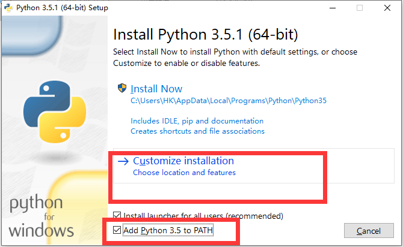
### 所有复选框都勾选上 
### 点击下方的Next
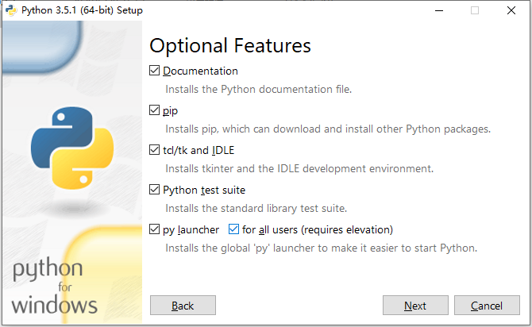
### 勾选上install for all users,其他的默认不动，安装目录C:\Program Files\Python 35默认也不用改
### 点击下方的Install开始安装
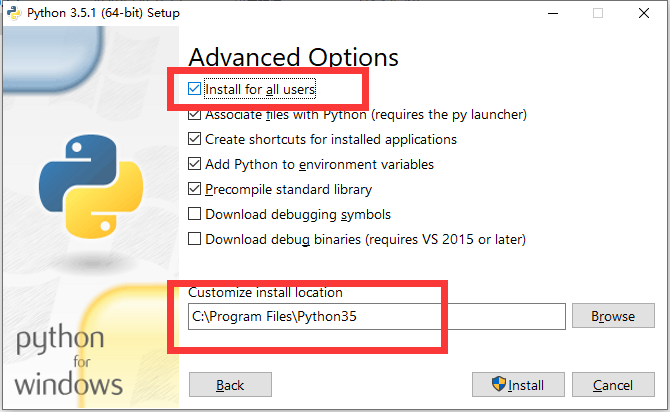
### 开始安装，请等待
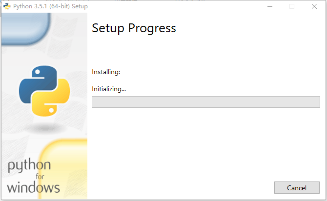
### 安装完成，点击Close
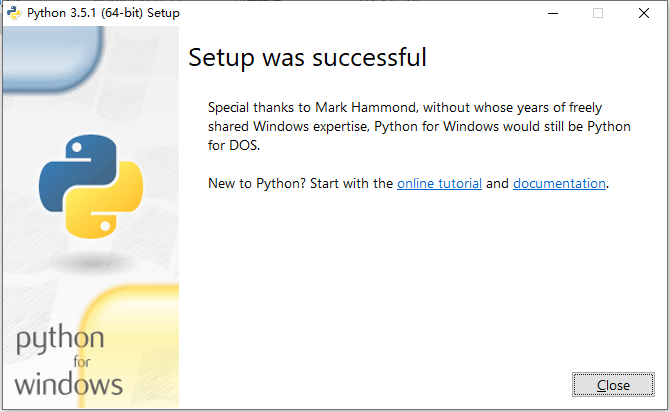
### 安装PyCharm Community Editon
### 双击安装程序
### 点击Next
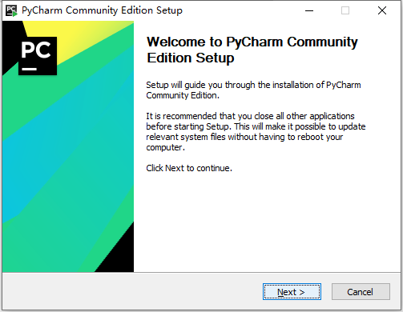
### 不用动，直接点Next
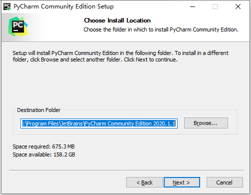
### 把这四个复选框都勾选上，都勾选上，都勾选上
### 点击next
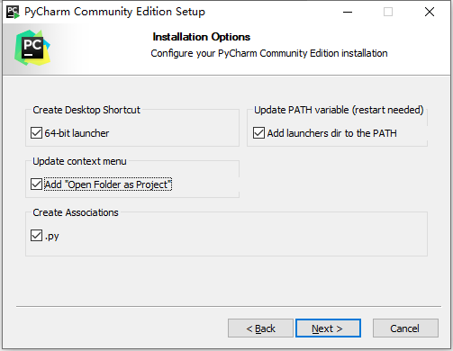
### 点击Install
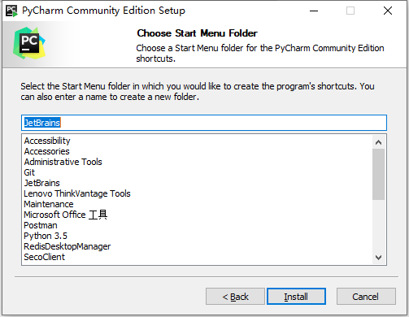
### 安装中，请等待
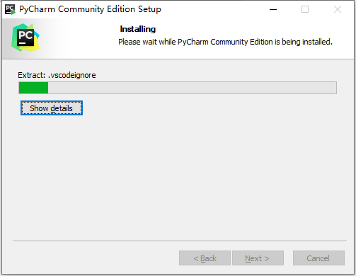
### 安装完成，点finish
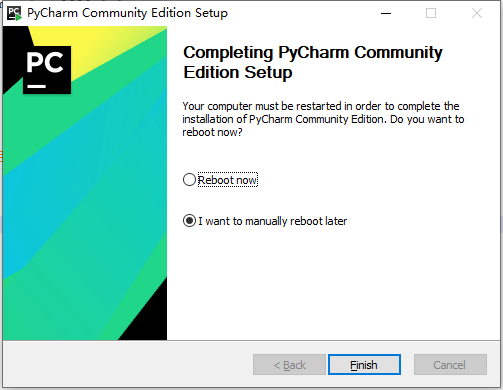
### 如何判断安装成功，按住微软徽标键+R键，然后输入cmd，然后回车
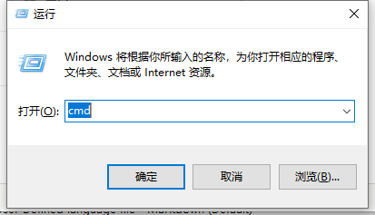
### 在黑咕隆咚的窗口中输入
```$xslt
python -V
```
### 然后回车，如果有输出 python 3.5.1之类的字样就是成功了，恭喜，congraluation!
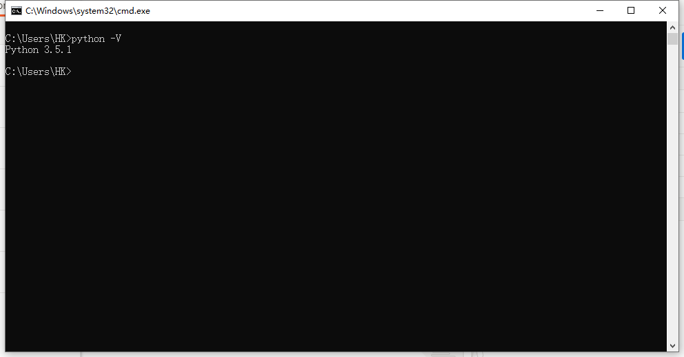
### 桌面上找到这个图标打开就可以开始写bug了(写代码了)
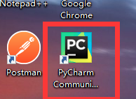
### 勾选红色方框处的同意许可协议
### 点击continue
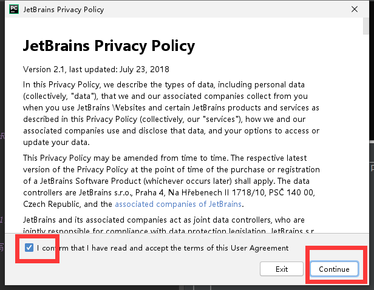
### 点击右下角的next
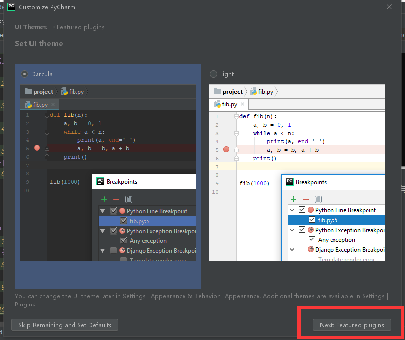
### 点击右下角的start Using Pycharm
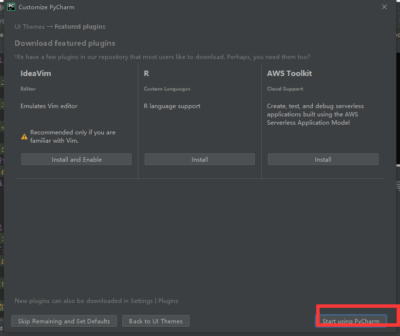
### 点击create  new project
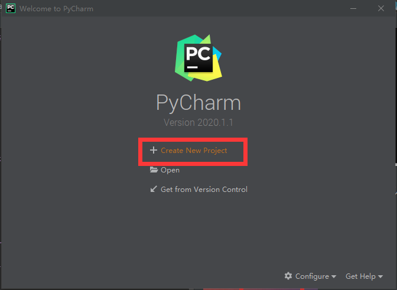
### 点击create
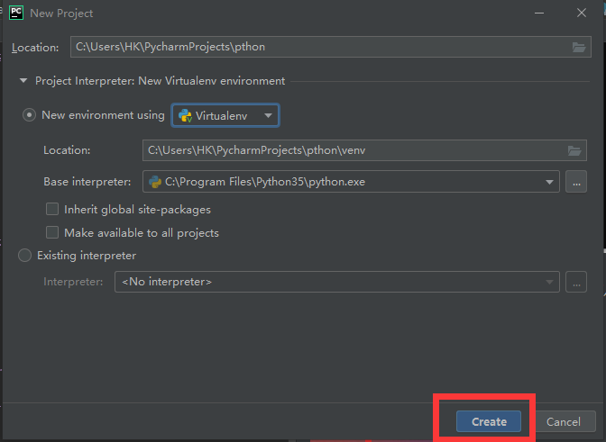
### 关于使用的提示框，没事可以看看，全英文的哦，咱们直接关闭
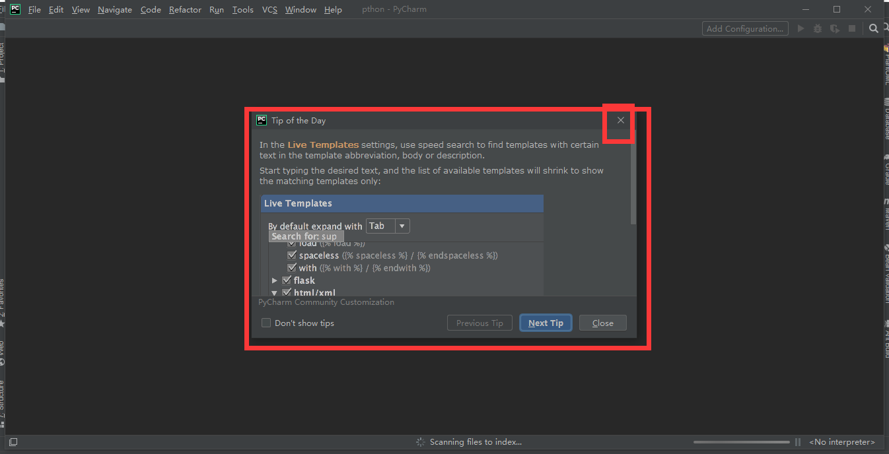
### 首次安装后的初始化操作，请等待
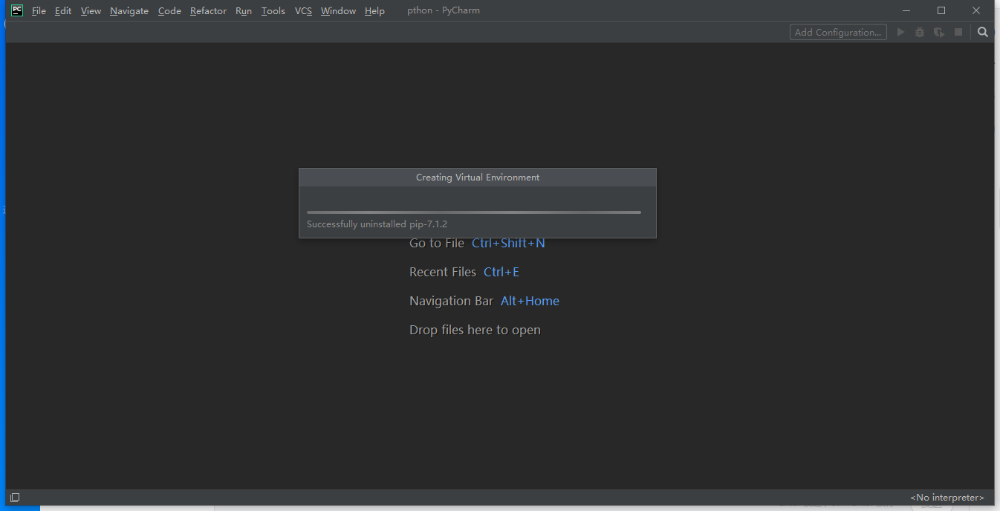
### 点击左侧的侧栏

### 右键鼠标选择创建一个python file
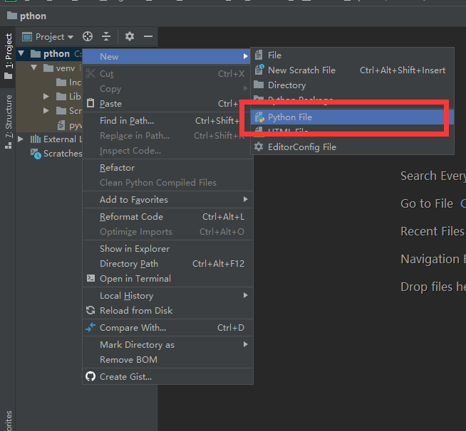
### 输入自己的第一个python程序名称，hello
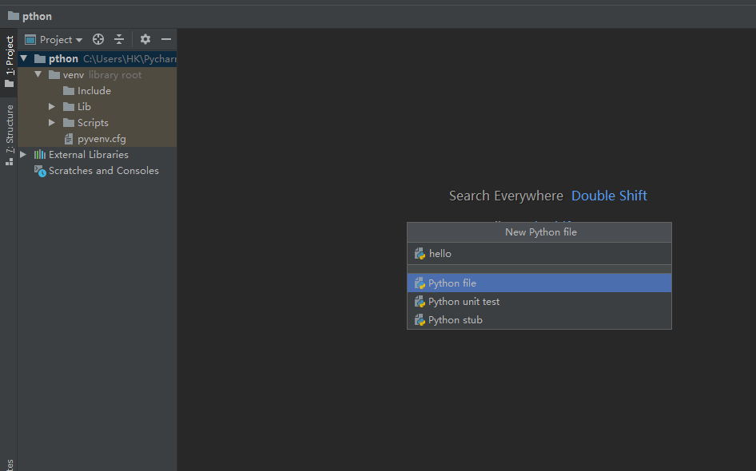
### 安装内容在python.py中输入
```$xslt
print("Hello,World")
```
点击下方的terminal控制台，然后输入命令
```$xslt
python hello.py
```
查看结果
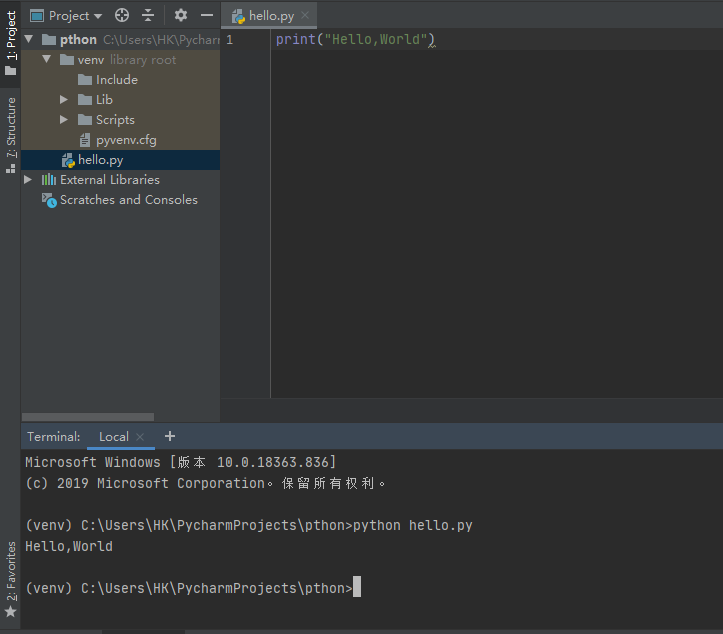